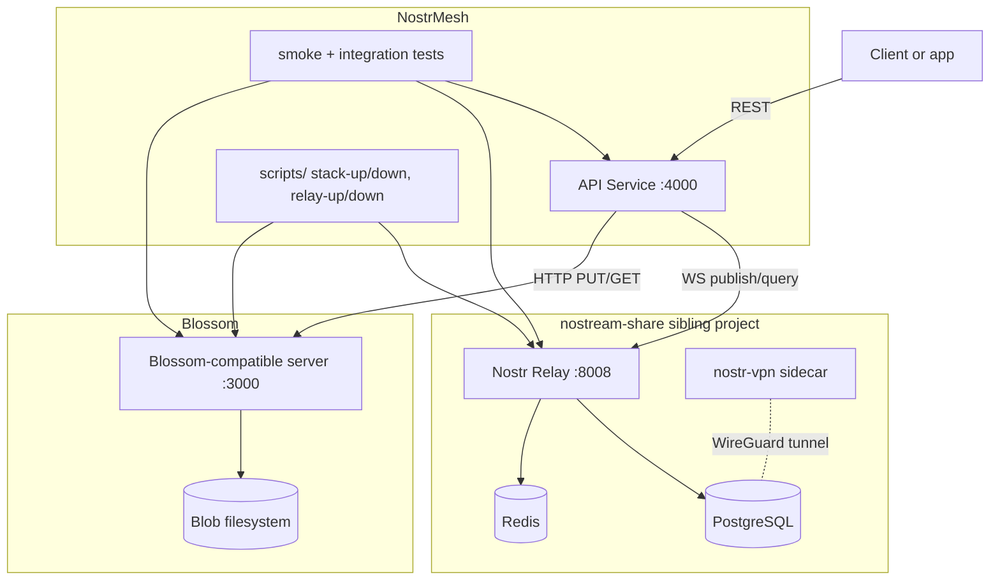
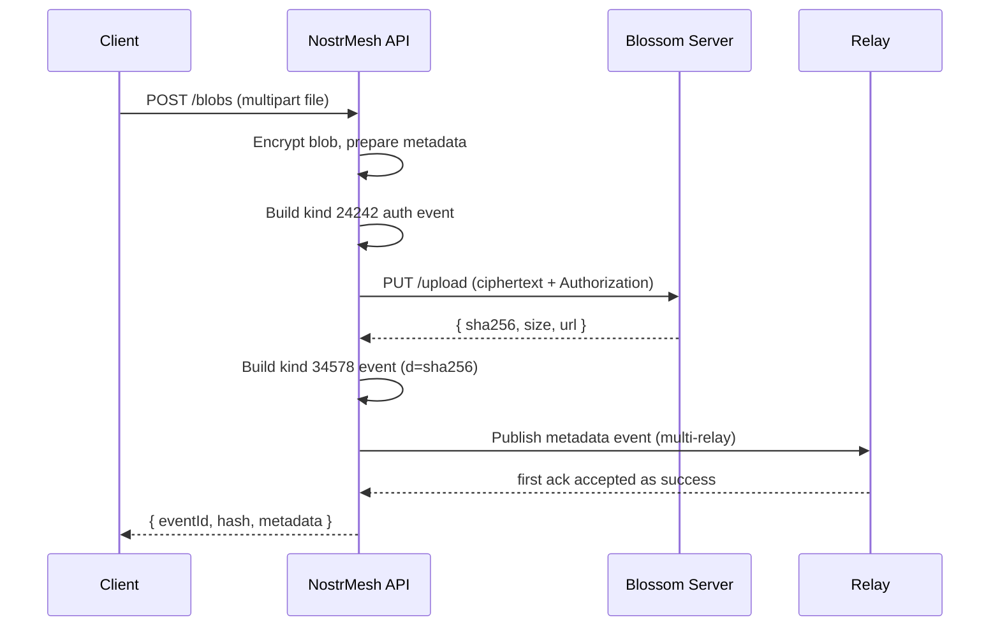
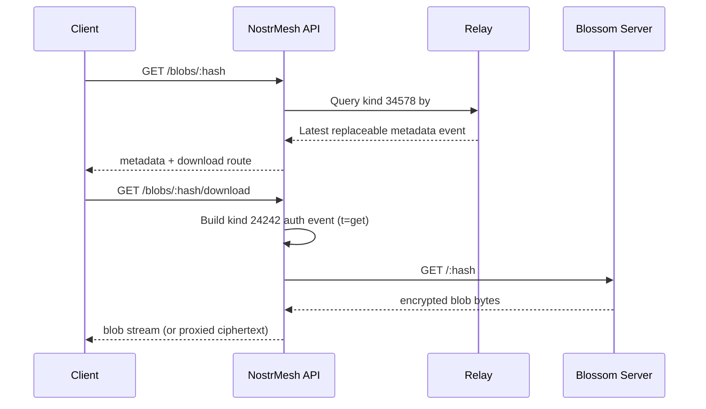

# NostrMesh Architecture

## Purpose
NostrMesh provides a backend storage module that combines:
- Nostr relay events for metadata and pub/sub
- Blossom-compatible blob storage for encrypted file data
- nostr-vpn (WireGuard) mesh networking for private distributed deployment

NostrMesh integrates with, but does not replace, the sibling relay project at `../nostream-share`.

## Boundaries

### Owned by NostrMesh
- Stack orchestration scripts (`scripts/`)
- Blob + metadata API (`api/`)
- Metadata schema and event semantics (`docs/metadata-schema.md`)
- Tests and runbooks (`tests/`, `docs/`)

### Reused from nostream-share
- Relay runtime and NIP support
- PostgreSQL and Redis infrastructure
- Existing ops scripts (`./scripts/start`, `./scripts/stop`)

### Reused from formstr-drive patterns
- Kind `24242` auth events for Blossom upload/get
- Kind `34578` parameterized replaceable metadata events
- `d=<sha256>` tag convention for blob-keyed metadata
- NIP-44 encrypted metadata payloads and soft-delete semantics

## Component Diagram

## Event Kinds Used

| Kind | Purpose | Replaceable | Notes |
| --- | --- | --- | --- |
| 24242 | Blossom auth token (NIP-98 style) | No | Tags include `t=upload|get` and short `expiration` |
| 34578 | Blob metadata | Parameterized | `d` tag is blob hash, payload encrypted with NIP-44 |
| 36363 | Blossom server announcements | Parameterized | Optional server discovery mode |

## Upload Sequence

## Download Sequence

## Network Notes
- Relay is expected at `ws://localhost:8008` in local mode.
- Blossom is expected at `http://localhost:3000` in local mode.
- `nostream-share` creates Docker network `nostream`; NostrMesh services should join this network for interop.
- `nostr-vpn` uses `network_mode: host` to manage the WireGuard `tun` interface natively and binds to tunnel IP (`10.44.x.y`).
