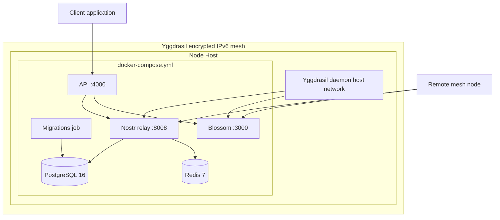
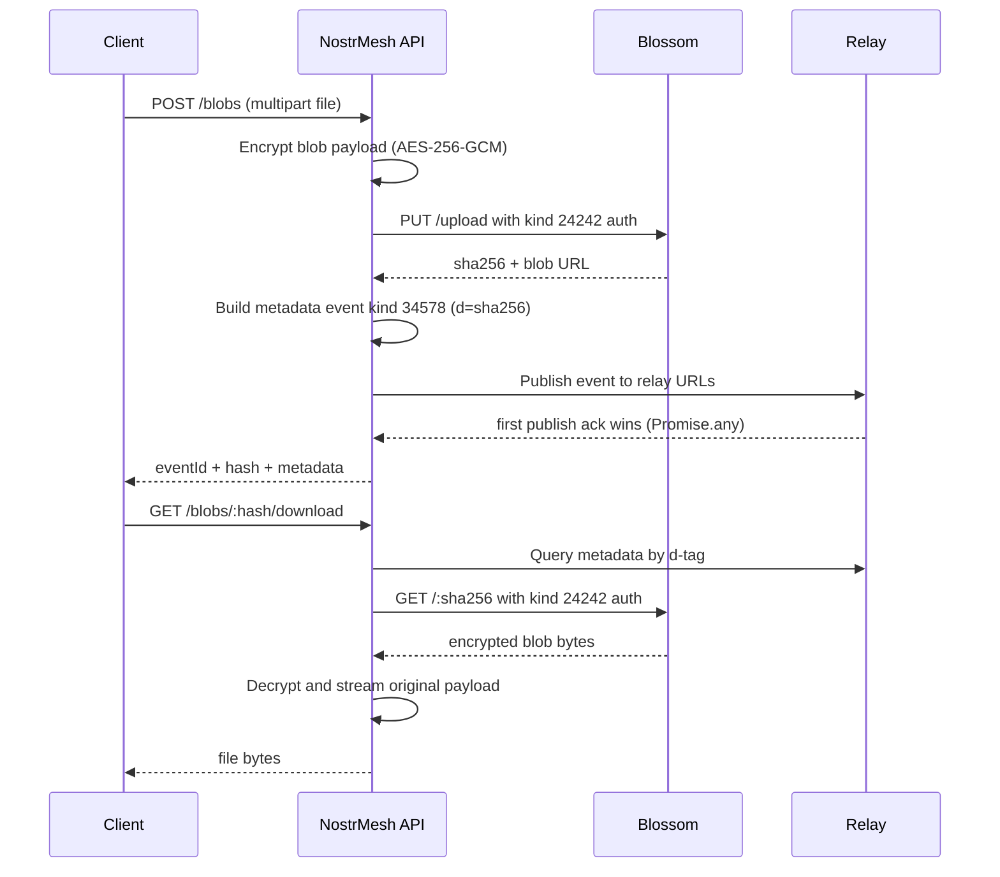

# NostrMesh Architecture (Mesh-Native)

## Purpose
NostrMesh is a storage backend that joins two distributed systems over a private mesh:

- Nostr relay events for metadata and pub/sub
- Blossom-compatible HTTP storage for encrypted blob payloads
- Yggdrasil IPv6 mesh networking for NAT traversal and node-to-node reachability

The main design constraint is that relay and blossom must both be reachable over mesh addresses. Yggdrasil is the network foundation, not an optional add-on.

## Ownership Boundaries

### NostrMesh-owned
- Orchestration and operations scripts in `scripts/`
- API service and metadata logic in `api/`
- Blossom-compatible server in `blossom/`
- Root compose stack in `docker-compose.yml`
- Test harness in `tests/`
- Architecture and runbooks in `docs/`

### External dependency (integrated, not reimplemented)
- Relay runtime from `nostream-share/`
- Relay migrations and knex config mounted into `migrate`
- PostgreSQL/Redis settings expected by the relay

Known upstream defects are tracked in `docs/external-repo-issues.md`.

## Runtime Topology

### Service exposure model
- `yggdrasil` runs in `host` network mode and creates mesh identity for the host.
- `relay` and `blossom` are port-mapped to host ports `8008` and `3000`.
- Any mesh peer can reach these via `ws://[mesh-ip]:8008` and `http://[mesh-ip]:3000`.

## Distributed Model

| Plane | Distributed Unit | Protocol | Canonical Endpoint |
| --- | --- | --- | --- |
| Metadata plane | Nostr events | WebSocket (Nostr relay) | `ws://[mesh-ip]:8008` |
| Blob plane | Encrypted binary blobs | HTTP (Blossom-compatible) | `http://[mesh-ip]:3000` |

The two planes are loosely coupled:
- Metadata events point to blob location (`metadata.server`) and key material.
- Blob storage is content-addressed by SHA-256 and can be fetched independently.

## Protocol Surface

### Event kinds in active use

| Kind | Role | Notes |
| --- | --- | --- |
| `24242` | Blossom auth event | Signed per request, tags include `t` and `expiration` |
| `34578` | Blob metadata event | Parameterized replaceable by `d=<sha256>` |

### Metadata payload contract
- Event tags include `d`, `client=nostrmesh`, and `encrypted=aead-v1`.
- Event content is base64-encoded `aead-v1` payload.
- Encryption uses AES-256-GCM with deterministic metadata key derivation from API secret.
- Blob payloads are encrypted separately with per-file AES-256-GCM keys.

## End-to-End Flow

Soft delete is modeled as a new kind `34578` event with the same `d` tag and `deleted: true`.

## Configuration Surfaces

### Internal service wiring
- `RELAY_URL` / `RELAY_URLS` default to `ws://nostrmesh-relay:8008`
- `BLOSSOM_URL` default to `http://nostrmesh-blossom:3000`

### Public address metadata
- `BLOSSOM_PUBLIC_URL` is written by `scripts/init-env.sh`
- When mesh address discovery succeeds, this is set to `http://[mesh-ip]:3000`
- API writes this value into metadata as `metadata.server`

## Security Model
- Blob reads and writes require signed kind `24242` authorization events.
- Metadata and blob payloads are encrypted before persistence.
- Yggdrasil provides encrypted node-to-node transport at network layer.
- Relay auth is force-disabled in local dev settings by `scripts/common.sh` to keep smoke flows deterministic.

## Failure Domains and Known Limits
- If Yggdrasil does not produce a mesh address, startup falls back to localhost public URLs.
- Relay publish/fetch for replaceable metadata may warn or fail due known upstream `nostream-share` defects.
- Those defects are external and documented in `docs/external-repo-issues.md`.

## Design Invariants
- Metadata must remain resolvable without trusting local-only hostnames.
- `metadata.server` must be mesh/public reachable for cross-node retrieval.
- Blob integrity is always verified through SHA-256 content addressing.
- At least one relay publish acknowledgement is required for write success.
