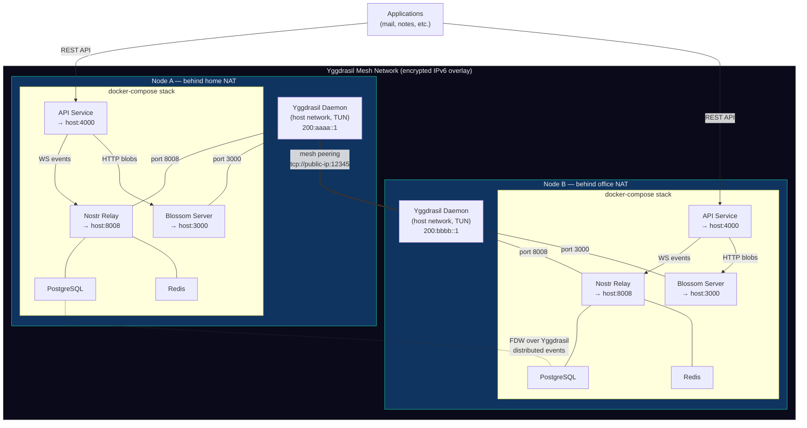
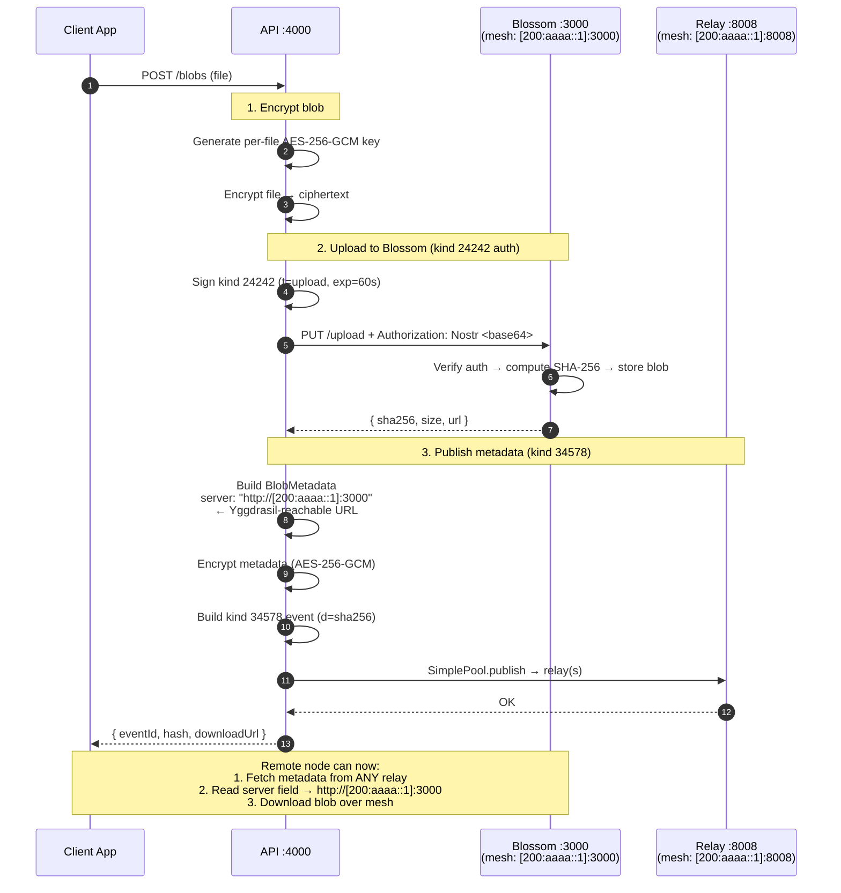
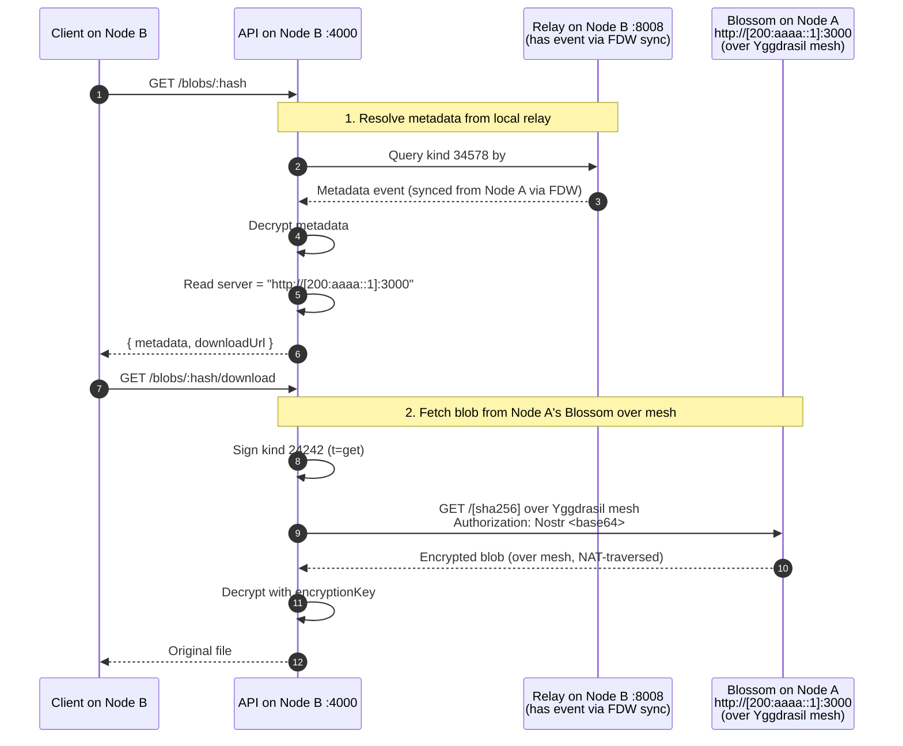

# NostrMesh — Implementation Plan (v4)

> Distributed backend storage over Yggdrasil mesh network. Two independently distributed systems — Nostr Relay (events) and Blossom Server (blobs) — both reachable over mesh for NAT traversal.

---

## Core Architecture Insight

The maintainer clarified the fundamental design:

> Both relay AND blossom need to be over the mesh, since nodes behind NAT restrictions won't work otherwise.

**Yggdrasil is not an add-on — it IS the networking layer.** Every service (relay, blossom) binds to the host, and the host gets a Yggdrasil IPv6 address (`200:xxxx::1`). Any node on the mesh can reach those services regardless of NAT, firewalls, or ISP restrictions. This is what makes it deployable in real-world environments.

```
┌─────────────────────────────────────────────────────────────┐
│                     Yggdrasil Mesh Network                  │
│              (encrypted IPv6 overlay, NAT-piercing)         │
│                                                             │
│  ┌─────── Node A ───────┐     ┌─────── Node B ───────┐     │
│  │  behind home NAT     │     │  behind office NAT   │     │
│  │                      │     │                      │     │
│  │  Relay    :8008  ────┼─────┼──→ reachable         │     │
│  │  Blossom  :3000  ────┼─────┼──→ reachable         │     │
│  │  API      :4000      │     │                      │     │
│  │                      │     │  Relay    :8008  ────┼──→  │
│  │  Yggdrasil IPv6:     │     │  Blossom  :3000  ────┼──→  │
│  │  200:aaaa::1         │     │  200:bbbb::1         │     │
│  └──────────────────────┘     └──────────────────────┘     │
│                                                             │
│  Both nodes are behind NAT but fully reachable to each     │
│  other via Yggdrasil IPv6 addresses.                       │
└─────────────────────────────────────────────────────────────┘
```

**Two independently distributed systems:**

| System | What's distributed | How | Over Mesh |
|---|---|---|---|
| **Nostr Relay** | Events (metadata, pub/sub) | nostream's distributed PostgreSQL via FDW, partitioned by `event_created_at` | Relay WebSocket at `ws://[200:xxxx::1]:8008`, DB FDW queries over Yggdrasil IPv6 |
| **Blossom Server** | Blobs (file data) | Content-addressed by SHA-256, each node stores its own blobs, clients can fetch from any node that has the blob | Blossom HTTP at `http://[200:xxxx::1]:3000` |

They are **not coupled**. A node could run just a relay, just blossom, or both. The API service is a convenience layer that ties them together for application use.

---

## Current State Audit

### ✅ Already Built

| Component | Files | Status |
|---|---|---|
| Architecture docs | `docs/architecture.md`, `docs/dependencies.md`, `docs/metadata-schema.md`, `docs/reference-formstr-drive.md` | Done but needs update to reflect mesh-native architecture |
| Custom Blossom server | `blossom/src/server.ts`, `blossom/config.yml`, `blossom/Dockerfile` | Done — kind 24242 auth, SHA-256 content-addressed, CORS, health |
| API service | `api/src/` — config, routes, blossom client, nostr client, crypto, metadata schema | Done but config hardcodes `localhost` URLs |
| Kind 24242 auth | `api/src/blossom/client.ts` | Done — own-key signing, base64 auth header |
| Kind 34578 metadata | `api/src/metadata/schema.ts` | Done — but `server` field stores `localhost` URL |
| Nostr client | `api/src/nostr/client.ts` + SimplePool | Done |
| Blob encryption | `api/src/crypto.ts` | Done — AES-256-GCM, per-file key |
| REST routes | `api/src/routes/blobs.ts`, `events.ts` | Done |
| Orchestration scripts | `scripts/*.sh` | Done but reference external `../nostream-share` |
| Smoke tests | `tests/smoke/relay-connectivity.sh`, `pubsub.sh` | Partial |
| Blossom compose | `docker-compose.blossom.yml` | Done (standalone blossom only) |

### 🔲 Gaps to Address

| Gap | Why It Matters |
|---|---|
| **Mesh-native config** | `publicBaseUrl`, `RELAY_URL`, `BLOSSOM_URL` all point to `localhost`. Cross-node communication won't work. Must use Yggdrasil IPv6 addresses. |
| **Self-contained docker-compose** | Mentor wants single `docker compose up`. Currently requires external `../nostream-share`. |
| **Yggdrasil address in metadata events** | `server` field in kind 34578 events must contain the Yggdrasil-reachable Blossom URL, not localhost. Otherwise remote nodes can't download blobs. |
| **Cross-node relay connectivity** | Relay WebSocket must be reachable at `ws://[ygg-ipv6]:8008`. nostream-share already supports this via host networking. |
| **Cross-node blossom access** | Blossom HTTP must be reachable at `http://[ygg-ipv6]:3000`. |
| **NAT traversal documentation** | Must explain WHY Yggdrasil — the NAT problem — in architecture docs. |
| **Integration tests** | Not written |
| **API Dockerfile** | Not created |
| **Demo script** | Not created |
| **Runbook with multi-node manual steps** | Not created |

---

## Proposed Changes

### Component 1: Self-Contained Docker Stack (mesh-native)

#### [NEW] Git submodule: `nostream-share/`

```bash
git submodule add https://github.com/Fromstr/nostream-share.git nostream-share
```

Pins the Fromstr relay code inside the repo. Compose references it as build context.

---

#### [NEW] `docker-compose.yml` (root)

All 7 services. **Key design**: Yggdrasil runs in `host` network mode, creating a TUN interface on the host. Relay and Blossom port-map to the host. This means they're automatically reachable via the host's Yggdrasil IPv6 address — **that's how NAT traversal works**.

```yaml
services:
  # ── Yggdrasil mesh node ──
  # Runs in host network mode to create TUN interface.
  # This gives the HOST a Yggdrasil IPv6 address (200:xxxx::1).
  # All port-mapped services become reachable over mesh.
  yggdrasil:
    build:
      context: ./nostream-share/docker/yggdrasil
    container_name: nostrmesh-yggdrasil
    network_mode: host
    cap_add: [NET_ADMIN]
    devices: [/dev/net/tun]
    volumes:
      - ./yggdrasil-config:/etc/yggdrasil
    environment:
      YGGDRASIL_LISTEN_PORT: ${YGGDRASIL_LISTEN_PORT:-12345}
    entrypoint: /coordinator-entrypoint.sh
    restart: always

  # ── PostgreSQL ──
  db:
    image: postgres
    container_name: nostrmesh-db
    environment:
      POSTGRES_DB: nostr_ts_relay
      POSTGRES_USER: nostr_ts_relay
      POSTGRES_PASSWORD: nostr_ts_relay
    volumes:
      - db-data:/var/lib/postgresql/data
      - ./nostream-share/postgresql.conf:/postgresql.conf:ro
      - ./nostream-share/pg_hba.conf:/pg_hba.conf:ro
    ports: ["5432:5432"]           # Exposed for FDW over Yggdrasil
    networks: [internal]
    command: >
      postgres -c 'config_file=/postgresql.conf'
               -c 'hba_file=/pg_hba.conf'
    restart: always
    healthcheck:
      test: ["CMD-SHELL", "pg_isready -U nostr_ts_relay"]
      interval: 5s
      timeout: 5s
      retries: 5
      start_period: 360s

  # ── Redis ──
  cache:
    image: redis:7.0.5-alpine3.16
    container_name: nostrmesh-cache
    volumes: [cache-data:/data]
    command: redis-server --loglevel warning --requirepass nostr_ts_relay
    networks: [internal]
    restart: always
    healthcheck:
      test: ["CMD", "redis-cli", "-a", "nostr_ts_relay", "ping"]
      interval: 1s
      timeout: 5s
      retries: 5

  # ── DB migrations ──
  migrate:
    image: node:18-alpine3.16
    container_name: nostrmesh-migrate
    environment:
      DB_HOST: nostrmesh-db
      DB_PORT: 5432
      DB_USER: nostr_ts_relay
      DB_PASSWORD: nostr_ts_relay
      DB_NAME: nostr_ts_relay
    entrypoint: ["sh", "-c",
      "cd code && npm install --no-save --quiet knex@2.4.0 pg@8.8.0
       && npx knex migrate:latest"]
    volumes:
      - ./nostream-share/migrations:/code/migrations:ro
      - ./nostream-share/knexfile.js:/code/knexfile.js:ro
    depends_on:
      db: { condition: service_healthy }
    networks: [internal]

  # ── Nostr Relay (nostream — Fromstr) ──
  # Port-mapped to host → reachable at ws://[ygg-ipv6]:8008
  relay:
    build: ./nostream-share
    container_name: nostrmesh-relay
    environment:
      SECRET: ${SECRET}
      RELAY_PORT: 8008
      NOSTR_CONFIG_DIR: /home/node/.nostr
      DB_HOST: nostrmesh-db
      DB_PORT: 5432
      DB_USER: nostr_ts_relay
      DB_PASSWORD: nostr_ts_relay
      DB_NAME: nostr_ts_relay
      DB_MIN_POOL_SIZE: 16
      DB_MAX_POOL_SIZE: 64
      DB_ACQUIRE_CONNECTION_TIMEOUT: 60000
      READ_REPLICA_ENABLED: "false"
      REDIS_HOST: nostrmesh-cache
      REDIS_PORT: 6379
      REDIS_USER: default
      REDIS_PASSWORD: nostr_ts_relay
    user: node:node
    volumes:
      - relay-config:/home/node/.nostr
    ports: ["8008:8008"]           # ← reachable over Yggdrasil
    depends_on:
      cache: { condition: service_healthy }
      db: { condition: service_healthy }
      migrate: { condition: service_completed_successfully }
    restart: on-failure
    networks: [internal]

  # ── Blossom Server (custom) ──
  # Port-mapped to host → reachable at http://[ygg-ipv6]:3000
  blossom:
    build: ./blossom
    container_name: nostrmesh-blossom
    environment:
      BLOSSOM_CONFIG: /app/config.yml
    volumes:
      - ./blossom/config.yml:/app/config.yml:ro
      - blossom-data:/data/blossom
    ports: ["3000:3000"]           # ← reachable over Yggdrasil
    networks: [internal]
    restart: unless-stopped

  # ── NostrMesh API ──
  api:
    build: ./api
    container_name: nostrmesh-api
    env_file: .env
    environment:
      RELAY_URL: ws://nostrmesh-relay:8008
      BLOSSOM_URL: http://nostrmesh-blossom:3000
      API_PORT: 4000
    ports: ["4000:4000"]
    networks: [internal]
    depends_on: [relay, blossom]
    restart: unless-stopped

networks:
  internal:
    name: nostrmesh

volumes:
  db-data:
  cache-data:
  relay-config:
  blossom-data:
```

**How NAT traversal works with this setup:**

```
Host runs Yggdrasil (network_mode: host) → gets IPv6 200:aaaa::1
Docker port-maps relay 8008 → host:8008
Docker port-maps blossom 3000 → host:3000

Remote node on mesh can connect to:
  ws://[200:aaaa::1]:8008    → reaches the relay
  http://[200:aaaa::1]:3000  → reaches blossom

Both work regardless of NAT because Yggdrasil handles traversal.
```

---

#### [MODIFY] `blossom/config.yml`

The `publicBaseUrl` must use the Yggdrasil address so that blob URLs in descriptors are mesh-reachable. This will be set dynamically at startup.

```yaml
server:
  host: 0.0.0.0
  port: 3000
  # Set dynamically via BLOSSOM_PUBLIC_URL env var at startup
  # Falls back to http://localhost:3000 for local-only dev
  publicBaseUrl: ${BLOSSOM_PUBLIC_URL:-http://localhost:3000}

storage:
  path: /data/blossom

limits:
  maxUploadBytes: 104857600

cors:
  allowedOrigins:
    - "*"   # Allow mesh peers — Yggdrasil is already encrypted + authenticated

auth:
  requireAuth: true
  maxClockSkewSeconds: 30
```

#### [MODIFY] `blossom/src/server.ts`

Support `BLOSSOM_PUBLIC_URL` env var to override `publicBaseUrl` from config. This lets the startup script inject the Yggdrasil address:

```bash
BLOSSOM_PUBLIC_URL=http://[200:aaaa::1]:3000
```

---

#### [MODIFY] `api/src/config.ts`

Add support for mesh-aware configuration:

```typescript
// For local (same docker-compose) communication:
relayUrl: "ws://nostrmesh-relay:8008"       // internal Docker DNS
blossomUrl: "http://nostrmesh-blossom:3000"  // internal Docker DNS

// For metadata events (stored in kind 34578, read by REMOTE nodes):
blossomPublicUrl: process.env.BLOSSOM_PUBLIC_URL
                  ?? "http://localhost:3000"
// ↑ This is what goes into metadata.server field
// Must be Yggdrasil-reachable for remote nodes to download blobs
```

#### [MODIFY] `api/src/routes/blobs.ts`

The `metadata.server` field must use the **public (mesh-reachable) URL**, not the internal Docker URL:

```typescript
const metadata: BlobMetadata = {
  // ...
  server: config.blossomPublicUrl,  // ← Yggdrasil URL, not localhost
};
```

---

#### [NEW] `scripts/init-env.sh`

On first run:
1. Generate `SECRET` for relay
2. Generate `NOSTR_SECRET_KEY` for API
3. Discover Yggdrasil IPv6 address (if Yggdrasil is running)
4. Set `BLOSSOM_PUBLIC_URL=http://[ygg-ipv6]:3000`
5. Set `RELAY_PUBLIC_URL=ws://[ygg-ipv6]:8008`
6. Write `.env`

#### [NEW] `scripts/discover-mesh-address.sh`

Queries Yggdrasil for the node's IPv6 address:

```bash
#!/usr/bin/env bash
# Returns the Yggdrasil IPv6 address of this node
yggdrasilctl getself 2>/dev/null | jq -r '.address // empty'
# Or from Docker: docker exec nostrmesh-yggdrasil yggdrasilctl getself ...
```

#### [NEW] `api/Dockerfile`

Multi-stage Node 22 build → distroless runtime (same pattern as blossom Dockerfile).

#### [MODIFY] `scripts/stack-up.sh`

Rewritten to:
1. Init git submodule if needed
2. Run `init-env.sh`
3. `docker compose up --build -d`
4. Wait for Yggdrasil to get its IPv6 address
5. Inject `BLOSSOM_PUBLIC_URL` into running blossom config (or restart with updated env)
6. Run health check
7. Print **mesh-reachable** URLs (not just localhost)

---

### Component 2: Mesh Connectivity Proof

#### [NEW] `scripts/mesh-test.sh`

1. Discover Yggdrasil IPv6 from container
2. Connect to relay via Yggdrasil address: `ws://[200:xxxx::1]:8008`
3. Connect to blossom via Yggdrasil address: `http://[200:xxxx::1]:3000/health`
4. Upload blob to blossom via Yggdrasil address (with kind 24242 auth)
5. Publish metadata event to relay via Yggdrasil address
6. Fetch metadata back
7. Download blob via Yggdrasil address
8. Verify SHA-256
9. Print structured report showing NAT traversal in action

---

### Component 3: Integration Tests

#### [NEW] `tests/integration/metadata-roundtrip.test.ts`

- Publish kind 34578 → fetch → decrypt → verify all fields
- Verify `server` field contains mesh-reachable URL (not localhost)
- Soft-delete with replacement event
- Dedup by d-tag

#### [NEW] `tests/integration/e2e-flow.test.ts`

- Upload → metadata → download → verify content
- Error cases: 404, 410, 400

---

### Component 4: Demo & Docs

#### [NEW] `scripts/demo.sh`

Automated end-to-end demo showing mesh-native storage:
1. Start stack
2. Print Yggdrasil address
3. Upload file via API
4. Show metadata event (with Yggdrasil blossom URL in `server` field)
5. Download via mesh address
6. Verify
7. Soft-delete
8. Verify 410

#### [NEW] `docs/runbook.md`

Including:
- Quick start: `git clone --recurse-submodules && ./scripts/stack-up.sh`
- **Why Yggdrasil**: NAT traversal explanation
- Environment variables (including mesh URLs)
- Health checks
- Troubleshooting (TUN permissions, port conflicts)
- **Multi-node manual steps**:
  1. Machine A: run full stack, note Yggdrasil public key + peer address from logs
  2. Machine B: set `COORDINATOR_PEER` and `COORDINATOR_PUBLIC_KEY`
  3. Machine B: run Yggdrasil with `storage-entrypoint.sh`
  4. Machine A: `./scripts/add-storage-node.sh` to register B
  5. Verify: ping6 between nodes, relay pub/sub across nodes, blob upload on A downloadable from B's mesh address

#### [MODIFY] `docs/architecture.md`

Complete rewrite to reflect mesh-native architecture:
- Yggdrasil as foundational networking layer (not an optional component)
- NAT traversal as core design requirement
- Two independently distributed systems diagram
- How services bind to host ports and become mesh-reachable
- Event metadata contains mesh-reachable URLs

---

## Architecture Diagrams

### System Architecture (Mesh-Native)



### Upload Flow (Mesh-Aware)



### Download Flow (Cross-Node, Mesh)



---

## Milestones

### M1 — Self-Contained Docker Stack (mesh-native)

| Task | Output |
|---|---|
| Add nostream-share as git submodule | `./nostream-share/` |
| Create root `docker-compose.yml` (7 services) | Single `docker compose up` |
| Create `api/Dockerfile` | API containerized |
| Create `scripts/init-env.sh` | Auto-generate secrets + discover Yggdrasil address |
| Create `scripts/discover-mesh-address.sh` | Yggdrasil IPv6 discovery |
| Modify `blossom/src/server.ts` — support `BLOSSOM_PUBLIC_URL` env | Mesh-reachable blob URLs |
| Modify `api/src/config.ts` — add `blossomPublicUrl` | Metadata stores mesh URL |
| Modify `api/src/routes/blobs.ts` — use `blossomPublicUrl` in metadata | Cross-node downloadable |
| Update `scripts/stack-up.sh` | Use root compose, print mesh URLs |
| Update `scripts/health-check.sh` | `nostrmesh-*` container names |

**Acceptance**: `docker compose up -d` → all 7 services running → relay reachable at `ws://[ygg-ipv6]:8008` → blossom at `http://[ygg-ipv6]:3000` → health check passes.

---

### M2 — Mesh Connectivity Proof

| Task | Output |
|---|---|
| `scripts/mesh-test.sh` | Upload/download blob via Yggdrasil IPv6 address |
| Verify relay reachable over mesh | WebSocket connection to `ws://[ygg-ipv6]:8008` |
| Verify blossom reachable over mesh | HTTP GET to `http://[ygg-ipv6]:3000/health` |
| Verify metadata `server` field contains mesh URL | Remote nodes can resolve blob location |

**Acceptance**: Blob uploaded via localhost API, metadata contains Yggdrasil blossom URL, blob downloadable via that mesh URL.

---

### M3 — Integration Tests & Demo

| Task | Output |
|---|---|
| `tests/integration/metadata-roundtrip.test.ts` | Metadata publish/fetch/decrypt |
| `tests/integration/e2e-flow.test.ts` | Full API flow test |
| `scripts/demo.sh` | Automated demo with mesh URLs |
| Demo recording | Terminal recording or command log |

**Acceptance**: All tests pass. Demo shows mesh-reachable URLs in output.

---

### M4 — Polish & Submission

| Task | Output |
|---|---|
| `docs/architecture.md` rewrite | Mesh-native architecture, NAT traversal |
| `docs/runbook.md` | Ops guide + multi-node manual steps |
| Update `PROJECT_PLAN.md` | Final status |
| CORS for mesh peers | `allowedOrigins: "*"` (Yggdrasil is encrypted) |

**Acceptance**: Clean clone → `./scripts/stack-up.sh` → `./scripts/demo.sh` → all evidence collected.

---

## Key Design Decisions

| Decision | Rationale |
|---|---|
| **Yggdrasil = foundational networking** | Solves NAT traversal. Nodes behind any NAT are fully reachable via mesh IPv6. |
| **Services port-map to host** | Combined with Yggdrasil host networking, this makes relay and blossom automatically mesh-reachable. |
| **Two independent distributed systems** | Relay distributes events (FDW), Blossom distributes blobs (content-addressed). Not coupled. |
| **Metadata `server` field = Yggdrasil URL** | Critical for cross-node download. Remote nodes read this field to know WHERE to fetch the blob. |
| **CORS `*` for blossom** | Yggdrasil traffic is already end-to-end encrypted. Mesh peers are effectively trusted. |
| **Auth stays on (kind 24242)** | Per mentor. Own-key signing. Already implemented. |
| **nostream (Fromstr code)** | Per user. Git submodule. Consistent with Fromstr ecosystem. |
| **Multi-node = manual docs** | Per user. `docs/runbook.md` covers manual peering steps. |

---

## Mapping to Expected Outcomes

| Expected Outcome | Status | Evidence |
|---|---|---|
| Set up project repository and architecture design document | ✅ → update needed | `docs/architecture.md` rewrite in M4 |
| Deploy a local Yggdrasil node and validate connectivity | 🔲 → M1 + M2 | `docker compose up` + `mesh-test.sh` |
| Research and document Nostr and Blossom architecture | ✅ | `docs/` directory |
| Set up and run a basic Nostr Relay (already exists) | ✅ → containerize | nostream-share submodule in compose |
| Implement basic publish/subscribe event flow | ✅ | `tests/smoke/pubsub.sh` |
| Prototype simple data storage using events | ✅ | Kind 34578 metadata events |
| Integrate Blossom Server for large file storage | ✅ → mesh-enable | Custom blossom in compose |
| Build API for storing and retrieving blobs via Nostr references | ✅ → mesh URLs | `api/src/routes/blobs.ts` |

---

## Verification Plan

```bash
# Start the self-contained stack
./scripts/stack-up.sh

# Verify mesh connectivity
./scripts/mesh-test.sh

# Smoke tests
./tests/smoke/relay-connectivity.sh
./tests/smoke/pubsub.sh

# Integration tests
cd api && npm test

# Full demo
./scripts/demo.sh

# Tear down
docker compose down
```

### Competency Submission Evidence
- [ ] Self-contained `docker compose up` from clean clone
- [ ] Yggdrasil IPv6 address in container logs
- [ ] Relay reachable at `ws://[ygg-ipv6]:8008`
- [ ] Blossom reachable at `http://[ygg-ipv6]:3000`
- [ ] Blob upload with kind 24242 auth
- [ ] Metadata event with mesh-reachable `server` URL
- [ ] End-to-end demo (upload → query → download → verify)
- [ ] Multi-node peering documented as manual steps
