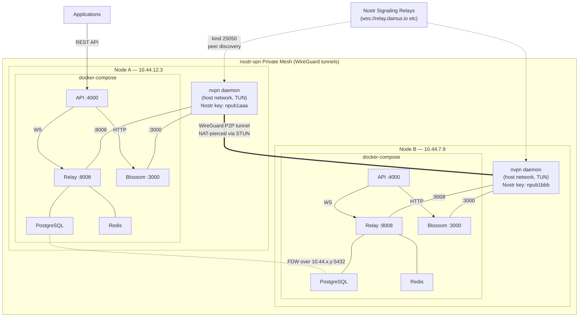
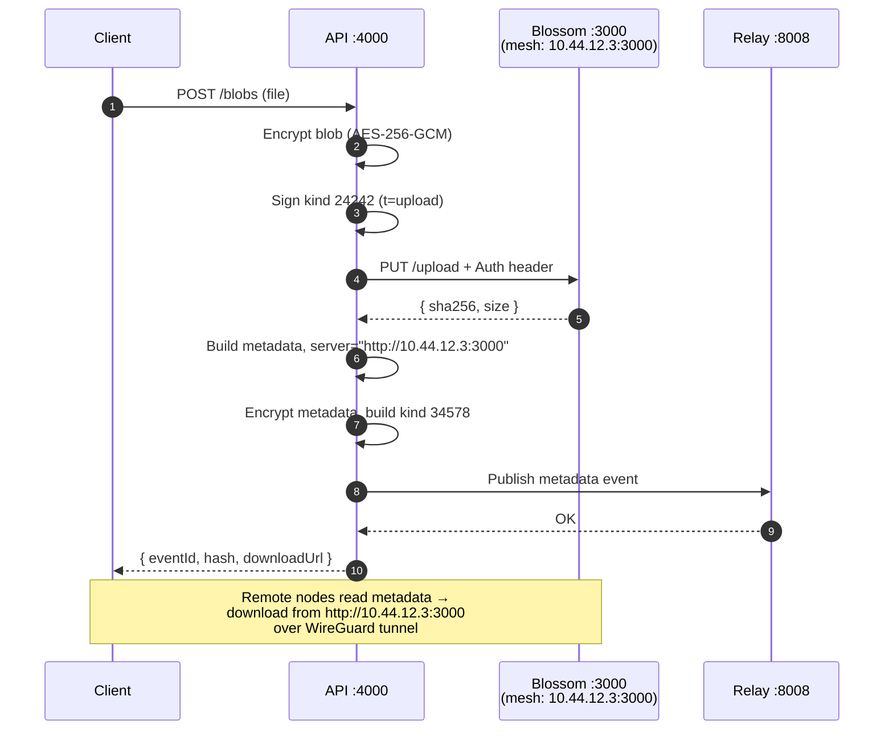
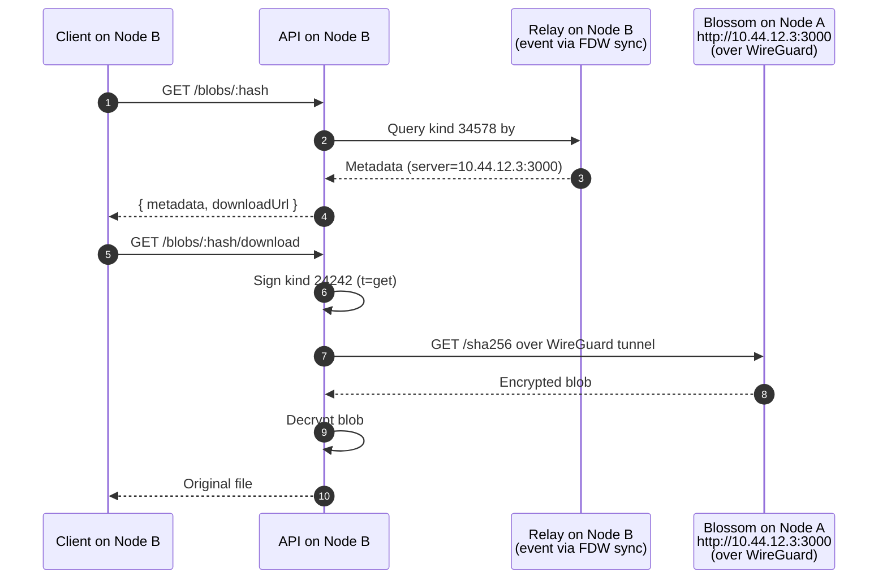

# NostrMesh — Implementation Plan (v5)

> **Pivot**: Networking layer changed from Yggdrasil to **nostr-vpn** (WireGuard + Nostr signaling). Private mesh, not public mesh.

---

## Why nostr-vpn over Yggdrasil

| Aspect | Yggdrasil | nostr-vpn |
|---|---|---|
| **Mesh type** | Public — any node can join the overlay | **Private** — invite-only participant allowlists |
| **Identity** | Yggdrasil keypairs (separate system) | **Nostr keypairs** — same identity for signaling AND mesh access |
| **Tunnel** | Custom overlay protocol | **WireGuard** via `boringtun` (battle-tested, kernel-fast) |
| **NAT traversal** | Relies on coordinator peering | STUN + UDP hole-punching + relay fallback |
| **Signaling** | Manual peer config exchange | **Nostr relays** — decentralized, automatic peer discovery |
| **Formstr alignment** | External identity system | **Same Nostr keys** used for relay auth, blossom auth, AND mesh identity |

The maintainer's rationale: *"Nostr-vpn is for a private mesh which is more suited for our usecase"* and *"WireGuard is one of those technologies you can fall in love with, it's also very reliable"*.

### The Elegant Formstr Alignment

nostr-vpn uses **Nostr keypairs as mesh identity**. This means:

```
ONE Nostr keypair per node does EVERYTHING:
  → Signs kind 24242 auth events for Blossom uploads
  → Signs kind 34578 metadata events for relay storage
  → Authenticates mesh VPN membership (nostr-vpn participant)
  → Encrypts signaling (NIP-44 v2) for peer discovery
  → Derives stable tunnel IPs: SHA256(network_id + pubkey) → 10.44.x.y/32
```

No separate identity systems. No Yggdrasil keypairs. No coordinator/storage split. Just Nostr keys everywhere — exactly the Formstr philosophy.

---

## Core Architecture

### The Three Layers

```
┌─────────────────────────────────────────────────────────┐
│            nostr-vpn Private Mesh (WireGuard)           │
│         Peer discovery via Nostr relay signaling        │
│                                                         │
│  ┌──── Node A (home NAT) ────┐  ┌── Node B (office) ──┐│
│  │ Nostr key: npub1aaa...    │  │ Nostr key: npub1bbb..│
│  │ Tunnel IP: 10.44.12.3    │  │ Tunnel IP: 10.44.7.9 ││
│  │                          │  │                      ││
│  │  Relay    → 10.44.12.3:8008  Relay → 10.44.7.9:8008│
│  │  Blossom  → 10.44.12.3:3000  Blossom→ 10.44.7.9:3000
│  │  API      → 10.44.12.3:4000                        ││
│  └──────────────────────────┘  └──────────────────────┘│
│                                                         │
│  Direct P2P WireGuard tunnels. NAT-pierced via STUN +  │
│  hole-punching. Relay fallback if direct fails.         │
└─────────────────────────────────────────────────────────┘
```

**Two independently distributed systems over the private mesh:**

| System | Distributed How | Mesh Address |
|---|---|---|
| **Nostr Relay** | PostgreSQL FDW across tunnel IPs | `ws://10.44.x.y:8008` |
| **Blossom Server** | Content-addressed, per-node storage | `http://10.44.x.y:3000` |

### nostr-vpn Protocol (kind 25050)

| Event | Purpose | Encryption |
|---|---|---|
| Public Hello (`d=hello`) | Heartbeat, peer presence | None (public) |
| Private Announce | WireGuard pubkey + endpoints + tunnel IP | NIP-44 v2 per-recipient |
| Roster | Admin-signed membership sync | NIP-44 v2 |
| Disconnect | Remove peer presence | NIP-44 v2 |
| Join Request (`d=join-request:*`) | New node requesting membership | NIP-44 v2, 7-day expiry |

Peer discovery is fully automatic via Nostr relays — no manual IP/key exchange needed.

---

## Maintainer's First Milestone

> *"Let's do a first PoC with distributed DBs inside nostr-vpn and let's move further from there"*

**PoC target**: Two nostream-share nodes, each running inside a nostr-vpn mesh, with PostgreSQL FDW queries flowing over WireGuard tunnel IPs instead of Yggdrasil IPv6.

---

## Current State Audit

### ✅ Already Built (reusable as-is)

| Component | Files |
|---|---|
| Custom Blossom server (kind 24242 auth) | `blossom/src/server.ts`, `blossom/Dockerfile` |
| API service (routes, crypto, metadata) | `api/src/` |
| Kind 24242 auth client | `api/src/blossom/client.ts` |
| Kind 34578 metadata events | `api/src/metadata/schema.ts` |
| Nostr SimplePool client | `api/src/nostr/client.ts` |
| AES-256-GCM blob encryption | `api/src/crypto.ts` |
| REST API routes | `api/src/routes/blobs.ts`, `events.ts` |
| Smoke tests | `tests/smoke/` |
| Architecture docs | `docs/` |

### 🔄 Needs Modification

| Component | Change |
|---|---|
| `docker-compose.yml` | Replace Yggdrasil container with nostr-vpn sidecar |
| `blossom/config.yml` | `publicBaseUrl` → tunnel IP instead of Yggdrasil IPv6 |
| `api/src/config.ts` | `blossomPublicUrl` → `http://10.44.x.y:3000` |
| `api/src/routes/blobs.ts` | `metadata.server` → tunnel-IP-based URL |
| `scripts/*.sh` | Replace Yggdrasil references with `nvpn` CLI |
| `docs/architecture.md` | Rewrite for nostr-vpn architecture |
| `nostream-share` pg_hba.conf | Allow `10.44.0.0/16` range instead of `200::/7` |

### 🗑️ Remove

| Component | Reason |
|---|---|
| `docker/yggdrasil/` (if any local copy) | Replaced by nostr-vpn |
| `yggdrasil-config/` | Replaced by `nvpn` config |
| Yggdrasil-specific scripts | No longer needed |

---

## Proposed Architecture

### docker-compose.yml (per node)

```yaml
services:
  # ── nostr-vpn mesh sidecar ──
  nvpn:
    image: ghcr.io/mmalmi/nostr-vpn:latest  # or build from source
    container_name: nostrmesh-vpn
    network_mode: host          # needs TUN interface on host
    cap_add: [NET_ADMIN]
    devices: [/dev/net/tun]
    volumes:
      - ./nvpn-config:/config
    environment:
      NVPN_CONFIG: /config/config.toml
    command: ["nvpn", "connect", "--config", "/config/config.toml"]
    restart: always

  # ── PostgreSQL ──
  db:
    image: postgres
    container_name: nostrmesh-db
    environment:
      POSTGRES_DB: nostr_ts_relay
      POSTGRES_USER: nostr_ts_relay
      POSTGRES_PASSWORD: nostr_ts_relay
    volumes:
      - db-data:/var/lib/postgresql/data
      - ./nostream-share/postgresql.conf:/postgresql.conf:ro
      - ./pg_hba.conf:/pg_hba.conf:ro   # allows 10.44.0.0/16
    ports: ["5432:5432"]
    networks: [internal]
    command: postgres -c 'config_file=/postgresql.conf' -c 'hba_file=/pg_hba.conf'
    restart: always
    healthcheck:
      test: ["CMD-SHELL", "pg_isready -U nostr_ts_relay"]
      interval: 5s
      timeout: 5s
      retries: 5
      start_period: 360s

  # ── Redis ──
  cache:
    image: redis:7.0.5-alpine3.16
    container_name: nostrmesh-cache
    volumes: [cache-data:/data]
    command: redis-server --loglevel warning --requirepass nostr_ts_relay
    networks: [internal]
    restart: always
    healthcheck:
      test: ["CMD", "redis-cli", "-a", "nostr_ts_relay", "ping"]
      interval: 1s
      timeout: 5s
      retries: 5

  # ── DB migrations ──
  migrate:
    image: node:18-alpine3.16
    container_name: nostrmesh-migrate
    environment:
      DB_HOST: nostrmesh-db
      DB_PORT: 5432
      DB_USER: nostr_ts_relay
      DB_PASSWORD: nostr_ts_relay
      DB_NAME: nostr_ts_relay
    entrypoint: ["sh", "-c",
      "cd code && npm install --no-save --quiet knex@2.4.0 pg@8.8.0 && npx knex migrate:latest"]
    volumes:
      - ./nostream-share/migrations:/code/migrations:ro
      - ./nostream-share/knexfile.js:/code/knexfile.js:ro
    depends_on:
      db: { condition: service_healthy }
    networks: [internal]

  # ── Nostr Relay (nostream) ──
  relay:
    build: ./nostream-share
    container_name: nostrmesh-relay
    environment:
      SECRET: ${SECRET}
      RELAY_PORT: 8008
      NOSTR_CONFIG_DIR: /home/node/.nostr
      DB_HOST: nostrmesh-db
      DB_PORT: 5432
      DB_USER: nostr_ts_relay
      DB_PASSWORD: nostr_ts_relay
      DB_NAME: nostr_ts_relay
      DB_MIN_POOL_SIZE: 16
      DB_MAX_POOL_SIZE: 64
      DB_ACQUIRE_CONNECTION_TIMEOUT: 60000
      READ_REPLICA_ENABLED: "false"
      REDIS_HOST: nostrmesh-cache
      REDIS_PORT: 6379
      REDIS_USER: default
      REDIS_PASSWORD: nostr_ts_relay
    user: node:node
    volumes: [relay-config:/home/node/.nostr]
    ports: ["8008:8008"]
    depends_on:
      cache: { condition: service_healthy }
      db: { condition: service_healthy }
      migrate: { condition: service_completed_successfully }
    restart: on-failure
    networks: [internal]

  # ── Blossom Server ──
  blossom:
    build: ./blossom
    container_name: nostrmesh-blossom
    volumes:
      - ./blossom/config.yml:/app/config.yml:ro
      - blossom-data:/data/blossom
    ports: ["3000:3000"]
    networks: [internal]
    restart: unless-stopped

  # ── NostrMesh API ──
  api:
    build: ./api
    container_name: nostrmesh-api
    env_file: .env
    environment:
      RELAY_URL: ws://nostrmesh-relay:8008
      BLOSSOM_URL: http://nostrmesh-blossom:3000
      API_PORT: 4000
    ports: ["4000:4000"]
    networks: [internal]
    depends_on: [relay, blossom]
    restart: unless-stopped

networks:
  internal:
    name: nostrmesh

volumes:
  db-data:
  cache-data:
  relay-config:
  blossom-data:
```

### How NAT Traversal Works Now

```
nvpn runs on host (network_mode: host) → creates WireGuard TUN
Host gets tunnel IP 10.44.x.y derived from: SHA256(network_id + nostr_pubkey)
Docker port-maps relay 8008 → host:8008, blossom 3000 → host:3000

Remote peer on mesh connects to:
  ws://10.44.x.y:8008    → relay (over WireGuard tunnel)
  http://10.44.x.y:3000  → blossom (over WireGuard tunnel)
  PostgreSQL 10.44.x.y:5432 → FDW queries (over WireGuard tunnel)

NAT traversal: STUN discovery → UDP hole-punching → relay fallback
All automatic. No port forwarding needed on either side.
```

### pg_hba.conf (modified for nostr-vpn)

```conf
# Allow FDW connections from nostr-vpn tunnel subnet
host all nostr_ts_relay 10.44.0.0/16 md5
# Local connections
host all nostr_ts_relay 0.0.0.0/0 md5
local all all trust
```

---

## Milestones

### M1 — PoC: Distributed DBs over nostr-vpn ⭐ (Maintainer's priority)

> *"Let's do a first PoC with distributed DBs inside nostr-vpn"*

| Task | Output |
|---|---|
| Install `nvpn` CLI on dev machine | Working binary |
| Create network: `nvpn init --participant <self>` | `nvpn-config/config.toml` |
| Create root `docker-compose.yml` (nostr-vpn sidecar) | Stack with nvpn + nostream + blossom + API |
| Modify `pg_hba.conf` to allow `10.44.0.0/16` | FDW over tunnel subnet |
| Create `scripts/init-env.sh` | Auto-generate secrets, nvpn config |
| Create `scripts/mesh-init.sh` | Initialize nvpn network, generate invite |
| Start single-node stack, verify tunnel IP assigned | `nvpn status` shows `10.44.x.y` |
| Verify relay + blossom reachable at tunnel IP | `curl http://10.44.x.y:3000/health` |
| **Two-node test**: second machine joins via invite | Both nodes peered |
| Set up FDW from Node A → Node B's PostgreSQL over tunnel | `add-storage-node.sh` using `10.44.x.y` |
| Verify cross-node query fan-out | `EXPLAIN` shows both partitions |

**Acceptance**: Two nostream instances, connected over nostr-vpn WireGuard tunnel, with FDW distributing event storage across both PostgreSQL databases.

---

### M2 — Blossom Over Mesh

| Task | Output |
|---|---|
| Modify `blossom/src/server.ts` — support `BLOSSOM_PUBLIC_URL` env | Mesh-reachable blob URLs |
| Modify `api/src/config.ts` — add `blossomPublicUrl` | Metadata stores tunnel URL |
| Modify `api/src/routes/blobs.ts` — use tunnel IP in metadata | `server: http://10.44.x.y:3000` |
| Upload blob on Node A, download from Node B via tunnel IP | Cross-node blob access |
| Verify metadata event contains tunnel-reachable blossom URL | Remote nodes can resolve |

**Acceptance**: Blob uploaded on Node A, metadata published with `server: http://10.44.x.y:3000`, downloadable from Node B over the WireGuard tunnel.

---

### M3 — Integration Tests & Demo

| Task | Output |
|---|---|
| `tests/integration/metadata-roundtrip.test.ts` | Metadata publish/fetch/decrypt |
| `tests/integration/e2e-flow.test.ts` | Full upload → download flow |
| `scripts/demo.sh` | Automated E2E demo |
| Demo recording | Terminal recording showing mesh URLs |

**Acceptance**: All tests pass against the stack. Demo shows tunnel IPs in all outputs.

---

### M4 — Polish & Submission

| Task | Output |
|---|---|
| `docs/architecture.md` rewrite | nostr-vpn architecture |
| `docs/runbook.md` | Ops guide + multi-node steps |
| Update `PROJECT_PLAN.md` | Final status |
| Multi-node manual steps in runbook | Join via invite, FDW setup |

**Acceptance**: Clean clone → `./scripts/stack-up.sh` → `./scripts/demo.sh` succeeds.

---

## Diagrams

### System Architecture



### Upload Flow



### Download Flow (Cross-Node)



---

## Key Design Decisions

| Decision | Rationale |
|---|---|
| **nostr-vpn replaces Yggdrasil** | Private mesh (invite-only) vs public. Maintainer's explicit direction. |
| **Single Nostr keypair** | Same key for relay auth, blossom auth, mesh identity. Pure Formstr alignment. |
| **WireGuard via boringtun** | Battle-tested, kernel-fast, reliable. Maintainer: "you can fall in love with it". |
| **Tunnel IPs in metadata** | `server: http://10.44.x.y:3000` — deterministic from `network_id + pubkey`. |
| **FDW over tunnel IPs** | Same distributed DB pattern as nostream-share, just using `10.44.x.y` instead of `200:xxxx`. |
| **nostream (Fromstr code)** | Git submodule. Consistent with ecosystem. |
| **Auth stays on (kind 24242)** | Own-key signing, already implemented. |

---

## Scripts Reference

| Script | Purpose |
|---|---|
| `scripts/mesh-init.sh` | Initialize nvpn network, generate invite link |
| `scripts/mesh-join.sh` | Import invite, join existing network |
| `scripts/stack-up.sh` | `nvpn connect` + `docker compose up` |
| `scripts/stack-down.sh` | `docker compose down` + `nvpn down` |
| `scripts/health-check.sh` | Check all services + mesh connectivity |
| `scripts/mesh-test.sh` | Verify cross-node relay + blossom + FDW |
| `scripts/demo.sh` | Full E2E demo |
| `scripts/discover-tunnel-ip.sh` | Print this node's tunnel IP |

---

## Mapping to Expected Outcomes

| Expected Outcome | How |
|---|---|
| Set up project repository and architecture doc | `docs/architecture.md` rewrite |
| Deploy a local mesh node and validate connectivity | `nvpn connect` + `scripts/mesh-test.sh` |
| Research and document Nostr and Blossom architecture | `docs/` (done) |
| Set up and run a basic Nostr Relay | nostream-share in compose (done) |
| Implement basic publish/subscribe event flow | `tests/smoke/pubsub.sh` (done) |
| Prototype simple data storage using events | Kind 34578 metadata (done) |
| Integrate Blossom Server for large file storage | Blossom in compose (done) |
| Build API for storing/retrieving blobs via Nostr | API routes (done, needs tunnel URL fix) |

---

## Verification Plan

```bash
# Initialize mesh network
./scripts/mesh-init.sh

# Start the stack
./scripts/stack-up.sh

# Verify mesh
./scripts/health-check.sh
./scripts/mesh-test.sh

# Integration tests
cd api && npm test

# Full demo
./scripts/demo.sh

# Tear down
./scripts/stack-down.sh
```
